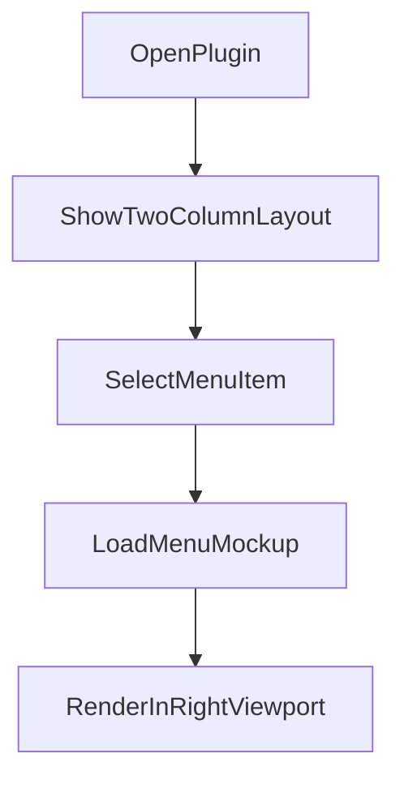
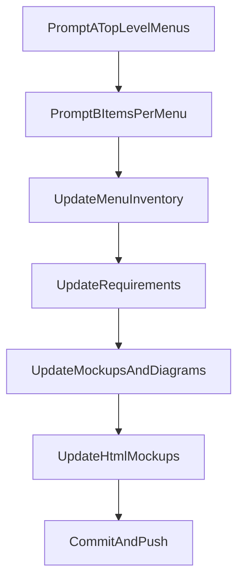
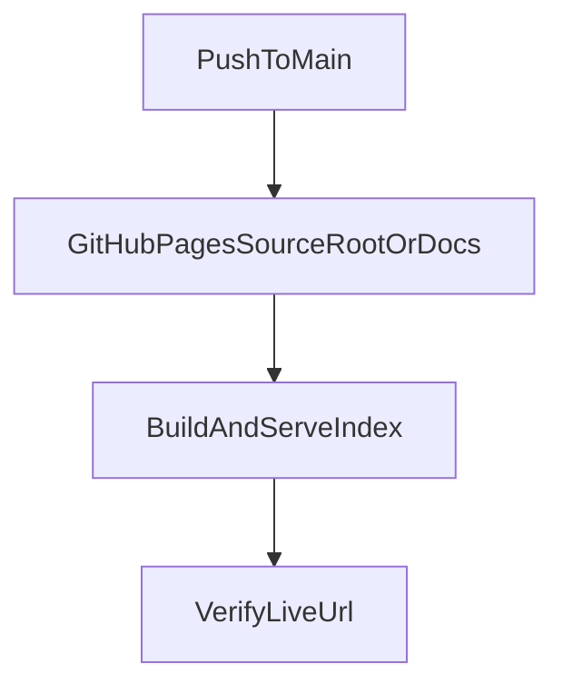

# Technical Flow Diagrams

## Interaction Flow

```mermaid
flowchart TD
  openPlugin[OpenPlugin]
  showLayout[ShowTwoColumnLayout]
  selectMenu[SelectMenuItem]
  loadMockup[LoadMenuMockup]
  renderViewport[RenderInRightViewport]
  openPlugin --> showLayout --> selectMenu --> loadMockup --> renderViewport
```

## Documentation Sync Flow

```mermaid
flowchart TD
  promptA[PromptATopLevelMenus]
  promptB[PromptBItemsPerMenu]
  updateInventory[UpdateMenuInventory]
  updateReq[UpdateRequirements]
  updateWireframes[UpdateMockupsAndDiagrams]
  updateHtml[UpdateHtmlMockups]
  commitPush[CommitAndPush]
  promptA --> promptB --> updateInventory --> updateReq --> updateWireframes --> updateHtml --> commitPush
```

## GitHub Pages Publishing Flow

```mermaid
flowchart TD
  mergeMain[PushToMain]
  pagesSource[GitHubPagesSourceRootOrDocs]
  buildSite[BuildAndServeIndex]
  verifySite[VerifyLiveUrl]
  mergeMain --> pagesSource --> buildSite --> verifySite
```
