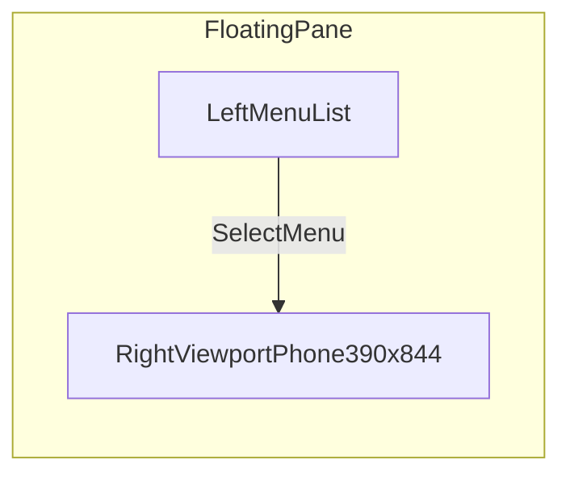
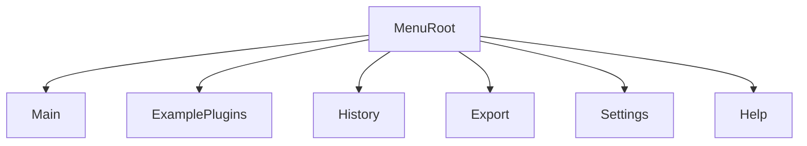
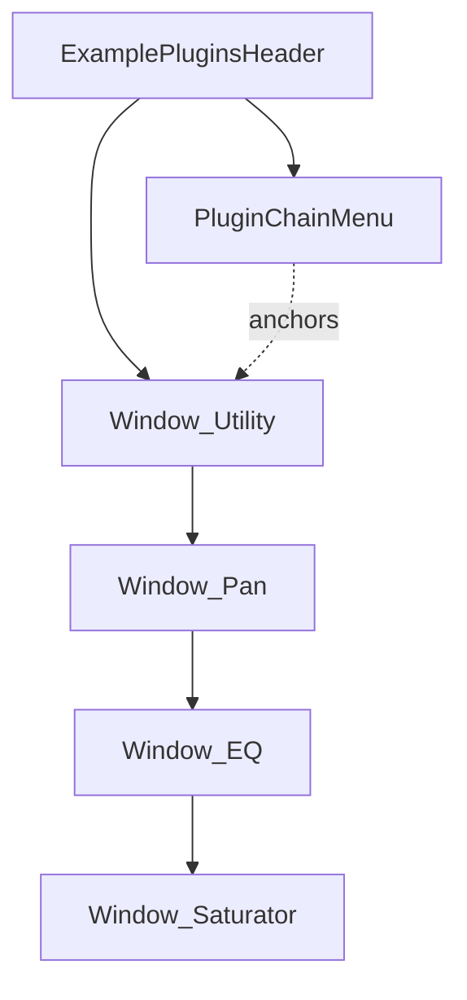
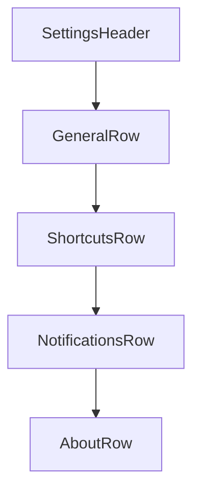

# Mockups and Wireframes

## Shell Wireframe

## Menu Navigation Wireframe

## ExamplePlugins Screen

- **Desktop / wide viewport:** chain menu on the left; Utility, Pan, EQ, Saturator as stacked plugin windows on the right (blank canvas + centered title each).
- **Mobile / narrow:** menu first, then the same windows stacked vertically.

## Settings Screen Skeleton

## Notes

- Replace placeholder rows with user-defined menu items from `docs/MENU_INVENTORY.md`.
- Keep one mockup section per top-level menu as the inventory evolves.
