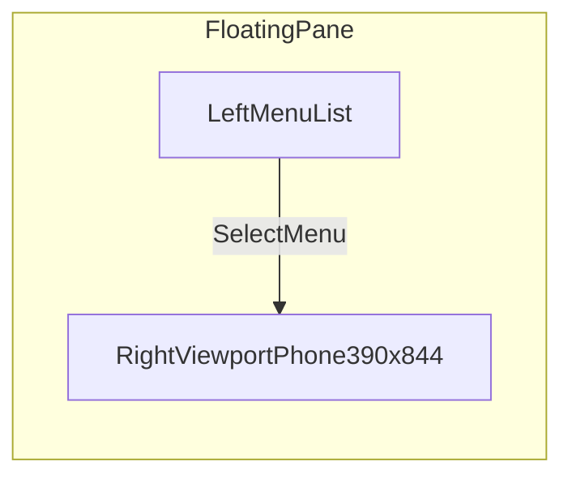
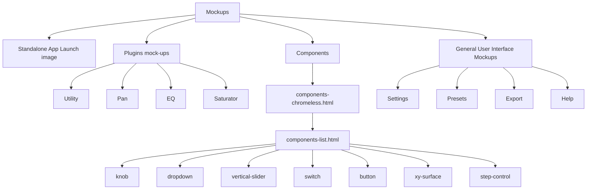
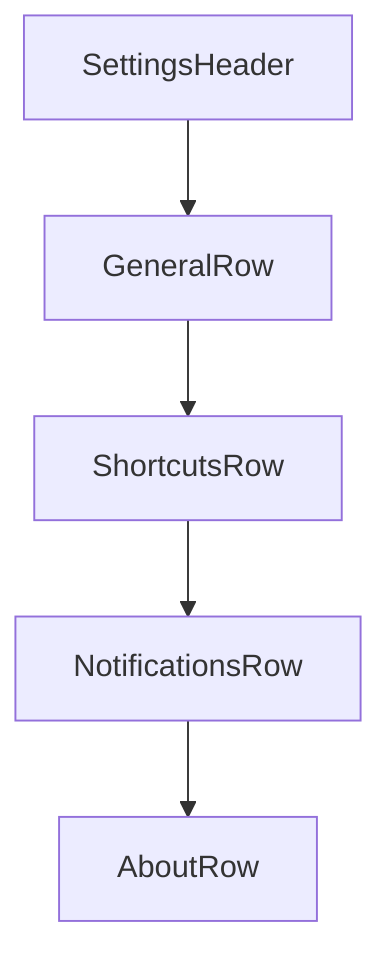

# Mockups and Wireframes

## Shell Wireframe

## Mockups navigation (shell)

**Components:** **Component mockups** → `components-chromeless.html` in **`#chromeless-iframe`**. Per-control pages: `component-mockup-knob`, `-dropdown`, `-vertical-slider`, `-switch`, `-button`, `-xy-surface`, `-step-control`. **`components-list.html`** — notes + inventory (linked from chromeless).

## Standalone App Launch image (blueprint page)

`mockups/blueprint-01-mockup-wireframe.html` + `mockups/blueprint-mockup-wireframe.css`:

- **Standalone app launch art** — same language as `main.html`.
- **Mockups and Wireframes** — collapsible block with **You are a…** card and wireframe canvas.

## Settings Screen Skeleton

## Notes

- Inventory: `docs/MENU_INVENTORY.md`.
- Mockups list uses flat rows + group headings.
