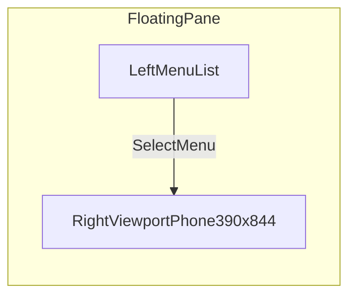
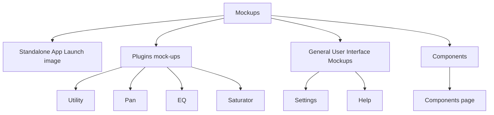
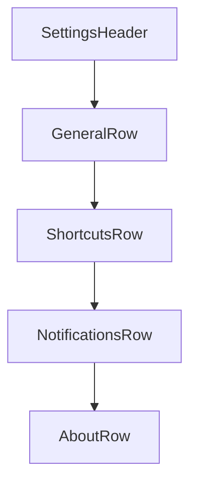

# Mockups and Wireframes

## Shell Wireframe

## Mockups navigation (shell)

_Under **Plugins mock-ups**: Utility, Pan, EQ, Saturator, then **Components** → `components.html` (200×200 mini windows + wireframes). Presets and Export are not in the menu._

## Standalone App Launch image (blueprint page)

`mockups/blueprint-01-mockup-wireframe.html` + `mockups/blueprint-mockup-wireframe.css`:

- **Standalone app launch art** — primary viewport content; same gradient / mark / progress bar language as `main.html`.
- **Mockups and Wireframes** — collapsible section below launch art. When expanded: **“You are a…” mockup** (labeled card) and **wireframe** canvas (**black** 2px strokes) plus project-standard wireframe subtext.

## Settings Screen Skeleton

## Notes

- Inventory: `docs/MENU_INVENTORY.md`.
- Under **Mockups**, rows use a flat list style (no white card per link); group headings separate **Plugins mock-ups** and **General User Interface Mockups**.
