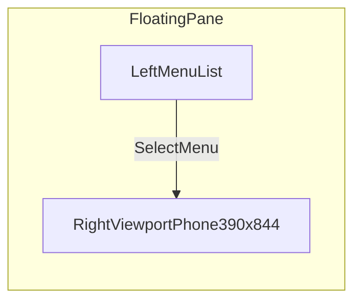
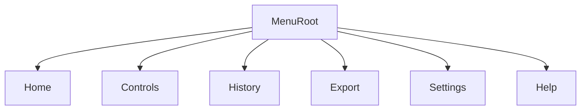
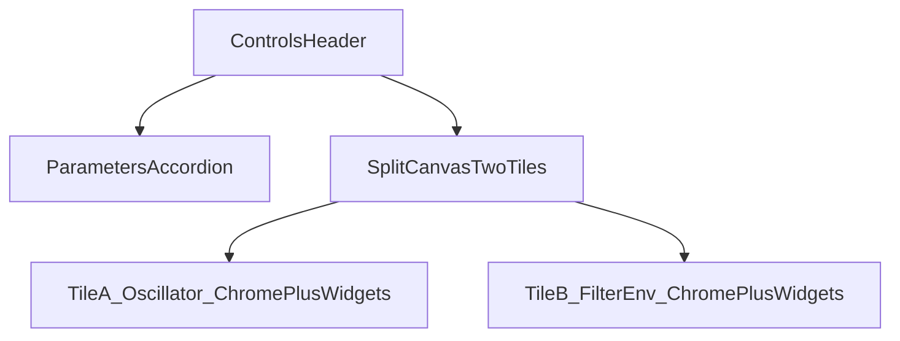
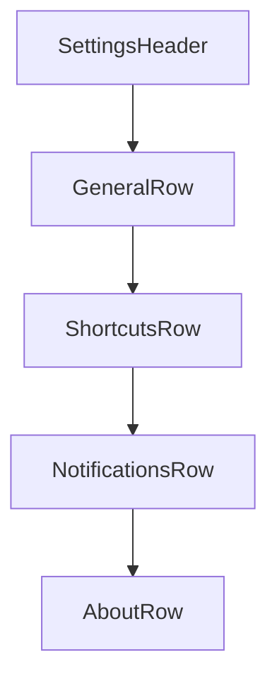

# Mockups and Wireframes

## Shell Wireframe

## Menu Navigation Wireframe

## Controls Screen (desktop-focused)

- **Narrow iframe:** parameters stack above canvas; tiles stack or sit in one column.
- **Desktop iframe (960×600):** parameters column + two tiles side by side; minimized/Ableton sizes out of scope for this layout.

## Settings Screen Skeleton

## Notes

- Replace placeholder rows with user-defined menu items from `docs/MENU_INVENTORY.md`.
- Keep one mockup section per top-level menu as the inventory evolves.
