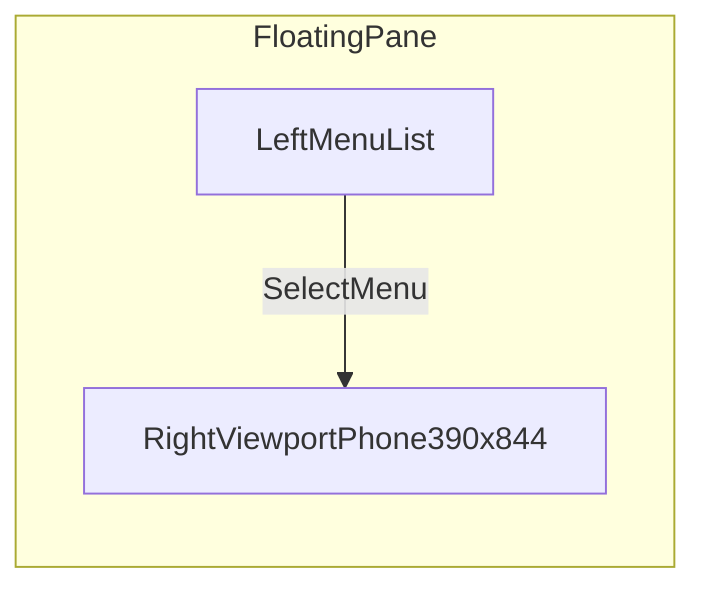
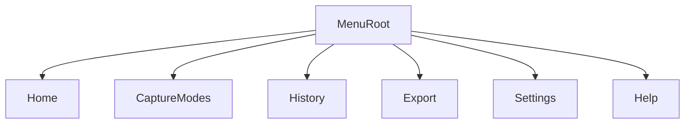
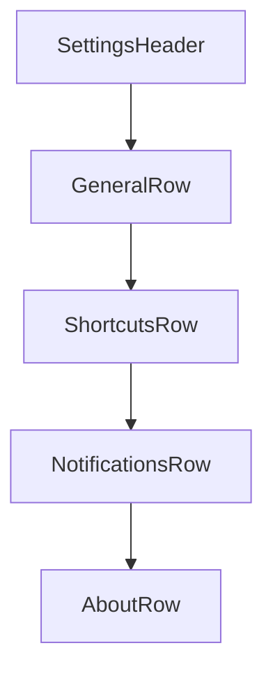

# Mockups and Wireframes

## Shell Wireframe

## Menu Navigation Wireframe

## Settings Screen Skeleton

## Notes

- Replace placeholder rows with user-defined menu items from `docs/MENU_INVENTORY.md`.
- Keep one mockup section per top-level menu as the inventory evolves.
