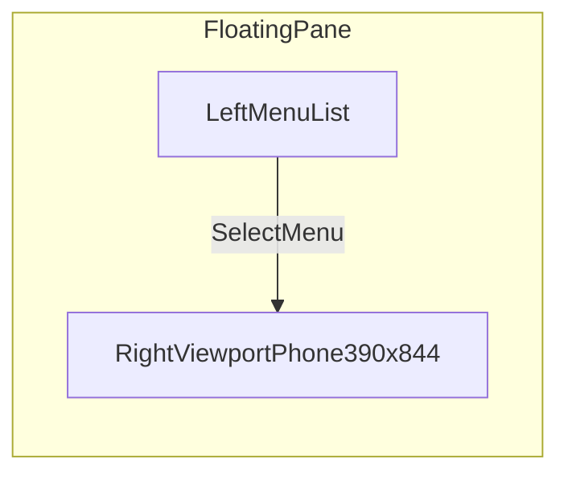
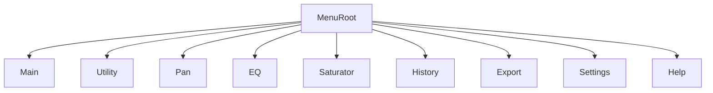
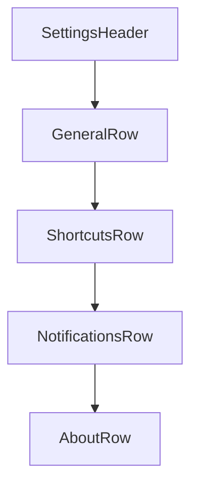

# Mockups and Wireframes

## Shell Wireframe

## Menu Navigation Wireframe

## Example plugin mockups

Four standalone pages (`example-utility.html`, `example-pan.html`, `example-eq.html`, `example-saturator.html`): full-viewport blank canvas with centered plugin title each.

## Settings Screen Skeleton

## Notes

- Replace placeholder rows with user-defined menu items from `docs/MENU_INVENTORY.md`.
- Keep one mockup section per top-level menu as the inventory evolves.
