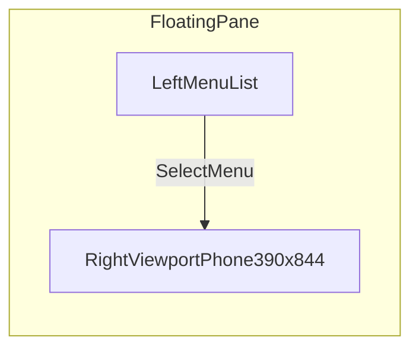
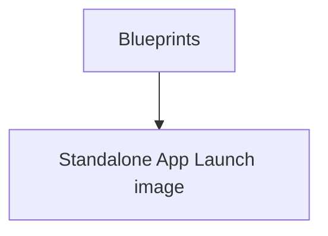
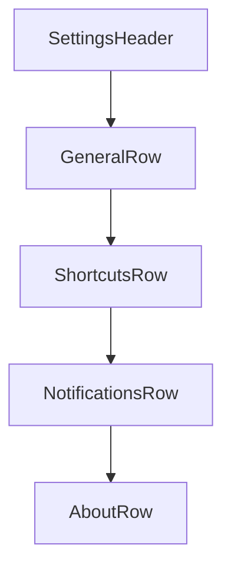

# Mockups and Wireframes

## Shell Wireframe

## Blueprints navigation (shell)

## Blueprint 1 — Standalone App Launch image

`mockups/blueprint-01-mockup-wireframe.html` + `mockups/blueprint-mockup-wireframe.css`:

- **Standalone app launch art** — primary viewport content; same gradient / mark / progress bar language as `main.html`.
- **Mockups and Wireframes** — collapsible section below launch art. When expanded: **“You are a…” mockup** (labeled card) and **wireframe** canvas (**black** 2px strokes) plus project-standard wireframe subtext.

## Settings Screen Skeleton

## Notes

- Replace placeholder rows with user-defined menu items from `docs/MENU_INVENTORY.md`.
- Add more blueprint rows in `index.html` as the inventory grows; each loads a different iframe target.
