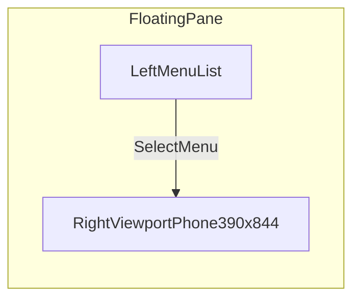
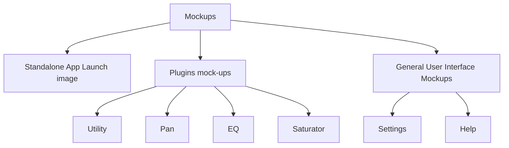
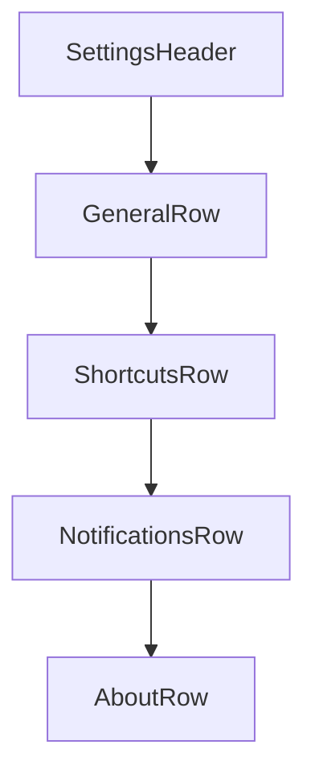

# Mockups and Wireframes

## Shell Wireframe

## Mockups navigation (shell)

_Presets and Export are not listed in the shell menu._

## Standalone App Launch image (blueprint page)

`mockups/blueprint-01-mockup-wireframe.html` + `mockups/blueprint-mockup-wireframe.css`:

- **Viewport** — Non-scrollable **desktop-style title bar** (title **Launch image**, red close control posts to parent to clear the mockup). Body: launch gradient, logo mark, **spinner** + progress bar, **Launch image** heading.
- **Host page** — When this mockup is selected under **Mockups**, **Standalone App Launch — detail** on `index.html` shows the **“You are a…”** card and **wireframe** canvas (same structure as before; moved out of the iframe).

## Settings Screen Skeleton

## Notes

- Inventory: `docs/MENU_INVENTORY.md`.
- Under **Mockups**, rows use a flat list style (no white card per link); group headings separate **Plugins mock-ups** and **General User Interface Mockups**.
